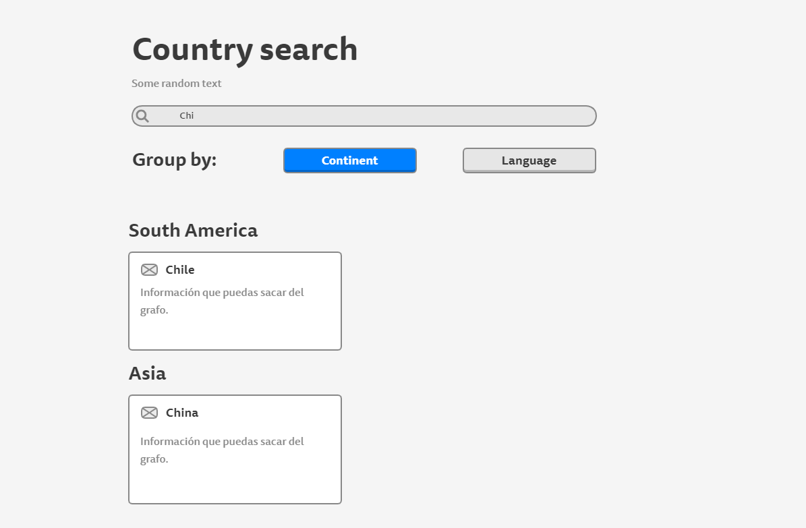

# Desafío para Software Engineers

Nombre postulante: [Heredia Lucas Francisco]
Link a la app en producción: [https://heredialucas.github.io/Kimche/]

## Desarrollo

Tomé la desición de usar npm antes de yarn, porque quería desarrollar lo más rápido posible y no quería que mi costumbre de usar npm tenga interferencia en el proyecto creado con yarn
 
Actualicé todas las dependencias a sus ultimas versiones, solucionando los conflictos y cambiando los métodos antiguos a los modernos, ya que me pareció la forma correcta de encarar el desafío
 
El proyecto es totalmente responsive y tiene un diseño propio y buscando un estilo moderno y liviano
 
Usé scss module por encima de style components ya que me pareció la forma más rápida de desarrollar la app, al tener mucha más práctica en la misma
 
Me tomé la libertad de agregar una página de detalle y también la de limpiar el agrupamiento seleccionado (Clear)

PD: Espero sea de du agrado! Un abrazo a todos! Graciiaaaas!!

## Respuesta:

En el caso que para la empresa sea totalmente necesario mantenerse en una estructura de peticiones SQL, buscaría mejorarla a travéz de un servicio distribuido en la nube, como por ejemplo https://www.cockroachlabs.com/
 
Y en el caso que estén dispuestos a migrar de tecnología, buscaría mejorar el rendimiento a travéz de peticiones NoSql, como por ejemplo con https://www.mongodb.com/es , ya que está pensada para cantidades abundantes de datos y de mejoras en rendimiento.

## Instrucciones

Debes crear un buscador de países consultando el [siguiente grafo](https://countries.trevorblades.com/). Este código contiene una base para seguir con la aplicación en React y ApolloClient. Queda a disposición tuya cualquier cambio, ya sea de estructura, estilo, etc.

Se espera que logres hacer una aplicación parecida a la del siguiente diagrama:

La funcionalidad y estructura debe ser igual, pero el diseño y variantes (por ejemplo, cambiar colores de las cosas) queda a tu gusto. **Considerar que el ícono al lado del nombre de cada país es el emoji**.

Además de esto, se espera que hagas deploy de tu app en el servicio que desees (Heroku, Netlify, AWS, Github Pages, etc).

## Consideraciones

- Se espera que uses buenas prácticas como gitflow (pull requests y commits), orden del código, estructura, eficiencia, etc.
- Puedes dejar comentarios de decisiones que tuviste que tomar y del por qué en este repositorio.
- Se va a considerar un buen diseño de UX/UI.

## Hints

Acá van algunas cosas que pueden ser útiles (o no 👀):

- [Gitignore](https://www.toptal.com/developers/gitignore)
- [GraphQL](https://www.howtographql.com/)
- [React](https://es.reactjs.org/)
- [Styled components](https://styled-components.com/docs/basics)
- [ApolloClient](https://www.apollographql.com/docs/react/)
- [Lodash](https://lodash.com/)
- [Conventional commits](https://www.conventionalcommits.org/en/v1.0.0/)
- [Commitlint](https://commitlint.js.org/#/)
- [Eslint](https://eslint.org/)
- [Eslint airbnb](https://www.npmjs.com/package/eslint-config-airbnb)
- [Husky](https://www.npmjs.com/package/husky)
